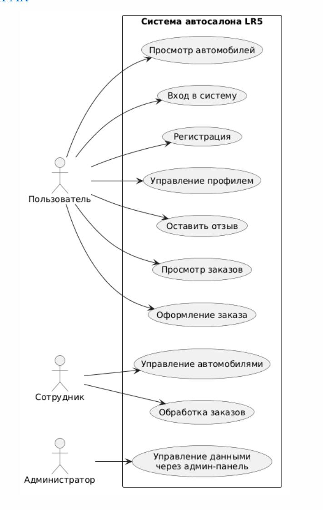

Спецификация требований
1. Бизнес-требования
- Назначение системы.
Система предназначена для автоматизации работы автосалона. Система предоставляет пользователям возможность просматривать доступные автомобили и оформлять заказы, а сотрудникам — управлять автомобилями и обрабатывать заказы. Также система предоставляет функции управления отзывами, промокодами и информационными материалами автосалона.
- Решаемая проблема.
Система решает проблему ручного управления информацией об автомобилях и заказах. Она объединяет данные об автомобилях, клиентах и заказах в одной информационной системе и предоставляет веб-интерфейс для работы с ними.
- Цели системы.
Система должна обеспечивать:
- централизованное хранение информации об автомобилях и заказах;
- просмотр пользователями доступных автомобилей;
- оформление и управление заказами;
- обработку заказов сотрудниками автосалона;
- управление отзывами пользователей;
- использование промокодов при оформлении заказа;
- управление информационными материалами автосалона;
- разграничение доступа пользователей и сотрудников.

2. Пользовательские требования

3. Функциональные требования
- FR-01. Система должна предоставлять регистрацию нового пользователя.
- FR-02. Система должна предоставлять пользователю возможность входа в систему.
- FR-03. Система должна предоставлять пользователю возможность выхода из системы.
- FR-04. Система должна предоставлять страницу профиля пользователя.
- FR-05. Система должна отображать список автомобилей.
- FR-06. Система должна хранить информацию о производителях автомобилей.
- FR-07. Система должна хранить категории автомобилей.
- FR-08. Система должна хранить характеристики автомобилей.
- FR-09. Система должна предоставлять сотруднику возможность добавлять автомобиль.
- FR-10. Система должна предоставлять сотруднику возможность редактировать автомобиль.
- FR-11. Система должна предоставлять сотруднику возможность удалять автомобиль.
- FR-12. Система должна предоставлять возможность создания заказа.
- FR-13. Система должна хранить информацию о заказе и его позиции.
- FR-14. Система должна связывать заказ с пользователем.
- FR-15. Система должна предоставлять административную панель для управления данными приложения.
- FR-16. Система должна предоставлять сотруднику возможность просматривать список заказов.
- FR-17. Система должна предоставлять сотруднику возможность изменять состояние заказа.
- FR-18. Система должна предоставлять сотруднику возможность взять заказ в обработку.
- FR-19. Система должна предоставлять возможность редактирования заказа в предусмотренных системой случаях.
- FR-20. Система должна предоставлять возможность удаления заказа в предусмотренных системой случаях.
- FR-21. Система должна поддерживать промокоды с процентом скидки.
- FR-22. Система должна учитывать активность и срок действия промокода.
- FR-23. Система должна предоставлять пользователям возможность просматривать отзывы.
- FR-24. Система должна хранить оценку, текст и даты создания и изменения отзыва.
- FR-25. Система должна предоставлять пользователю возможность создавать, редактировать и удалять собственный отзыв.

4. Нефункциональные требования
- NFR-01. Производительность.
Время ответа основных страниц приложения не должно превышать 2 секунд при штатной нагрузке.
- NFR-02. Безопасность.
Доступ к функциям управления автомобилями и заказами должен предоставляться только пользователям с соответствующими правами.
- NFR-03. Разграничение доступа.
Функции пользователя, сотрудника и администратора должны быть разделены в соответствии с их ролями.
- NFR-04. Совместимость.
Система должна запускаться в Docker-контейнере с использованием предоставленного Dockerfile и docker-compose.yml.
- NFR-05. Хранение данных.
Данные приложения должны храниться в базе данных SQLite и обрабатываться средствами Django ORM.
- NFR-06. Надёжность.
При корректной работе приложения операции с данными не должны приводить к потере уже сохранённых данных.
- NFR-07. Сопровождаемость.
Исходный код должен быть разделён на отдельные Django-приложения по функциональному назначению.
- NFR-08. Развёртывание.
После клонирования репозитория проект должен запускаться с помощью команды docker compose up --build.